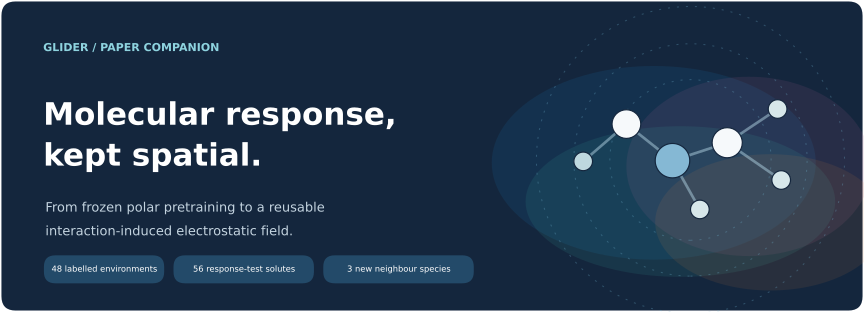
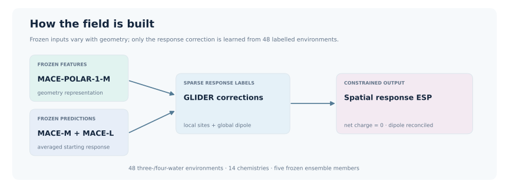
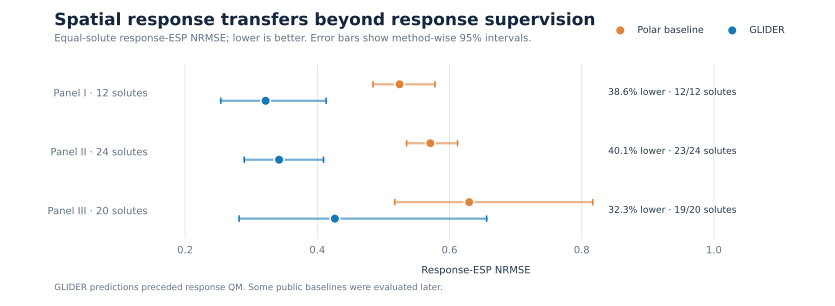
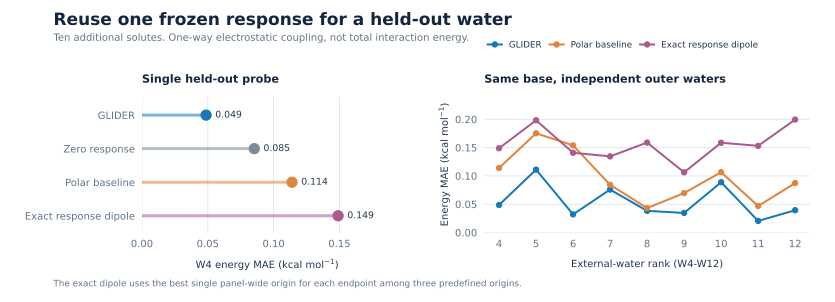
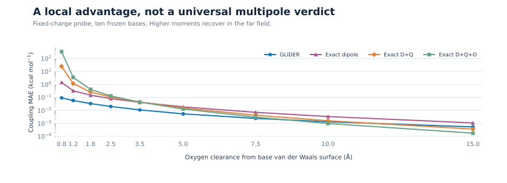

<div align="center">
  

  # GLIDER · Molecular response, kept spatial

  **Code, frozen predictions, reference observables and source data for**  
  *Sparse Supervision Turns Polar Pretraining into Transferable Molecular Response Fields*  
  Gal Oren · Boris Fain · Michael Levitt · 2nd SIMBIOCHEM Workshop at NeurIPS 2026

  [Explore the results](#the-results-at-a-glance) · [Run the frozen model](#run-the-frozen-model) · [Find a paper result](results/README.md) · [Browse source data](data/README.md)
</div>

---

## Why a spatial response?

When a molecule meets a neighbour, their electrons rearrange. A molecular dipole summarizes part of that change, but a nearby molecule samples the electrostatic potential at **particular positions**. Two environments can have almost the same response-dipole magnitude while presenting different local potentials.

The paper defines its target at fixed nuclear geometry and in the same complex-centred basis:

$$
\Delta V_{\mathrm{resp}}(\mathbf r;X)
=V_{SE}(\mathbf r;X)-V_S^{E\text{-ghost}}(\mathbf r;X)-V_E^{S\text{-ghost}}(\mathbf r;X).
$$

GLIDER predicts this **interaction-induced response potential**, represented by atom-centred response charges and dipoles. It enforces zero total response charge and consistency with its predicted molecular response dipole. The electric field is the negative gradient of the potential. This response is the mutual electronic change of both fragments; it is not a unique polarization/charge-transfer decomposition.



The 48 labelled training environments span 14 chemistries and each contain a solute with three waters. MACE-POLAR-1-M supplies frozen geometry features. Frozen MACE-POLAR-1-M and -1-L predictions supply an averaged starting response. Only the GLIDER response head is fitted to the response labels. We call the independently evaluated, response-unfitted **MACE-POLAR-1-L the polar baseline** below.

## The results at a glance

The same frozen GLIDER checkpoint is evaluated on three prospective panels. Their 56 solute identities were absent from **GLIDER response supervision**; exposure in the broad foundation pretraining is unknown. Each solute has four water configurations, giving 224 environments.

| Prospective panel | Solutes / environments | GLIDER response-ESP NRMSE | Polar baseline NRMSE | Relative reduction | Solutes improved |
|:--|--:|--:|--:|--:|--:|
| I | 12 / 48 | 0.322 | 0.524 | 38.6% | 12 / 12 |
| II | 24 / 96 | 0.342 | 0.571 | 40.1% | 23 / 24 |
| III | 20 / 80 | 0.427 | 0.630 | 32.3% | 19 / 20 |



These are **spatial response** results. The global response-dipole comparisons are less decisive; the paper does not claim uniformly better dipoles. Panel I also missed a separate, broader preregistered gate that required both ESP and dipole gains. All its cases and the frozen checkpoint were retained.

Two further tests ask whether the field transfers and whether it is useful:

| Test | What changed | Result | Boundary |
|:--|:--|:--|:--|
| New neighbour species | Three-water environments were replaced by NH₃, CH₃OH or CH₃CN environments for **12 separate solutes** (72 cases). | Response-ESP NRMSE 0.450 for GLIDER vs 0.617 for the predeclared polar baseline, a 27.0% reduction. | Both neighbour identity and environment size change; this is not a controlled single-variable substitution. |
| Held-out water | A fourth water probes a base response from a solute plus W1–W3. It enters neither the model input nor the base-response calculation. | Frozen one-way response-coupling energy MAE is **0.049** kcal mol⁻¹ for GLIDER vs **0.114** for the polar baseline at W4. | This is a Coulomb response component, not full interaction energy, solvation energy or self-consistent polarization. |



The exact QM response dipole is a stringent global-moment control: it uses the full response-dipole vector at one predefined origin but discards higher spatial detail. Its near-field errors do not imply that a dipole is inaccurate at all distances. Higher-order exact multipoles recover with distance and eventually outperform GLIDER in the fixed-charge far-field test.



## Run the frozen model

Python 3.11 or newer is recommended. Reading the tables and regenerating the repository gallery needs only the lightweight dependencies. **New-geometry inference** additionally needs PyTorch, ASE, the matching [MACE source](https://github.com/ACEsuit/mace) and the official MACE-POLAR-1 M/L checkpoints. Third-party checkpoints are downloaded from their publisher and are not redistributed here.

```bash
python -m venv .venv
source .venv/bin/activate
pip install -e '.[figures,model]'
pip install 'git+https://github.com/ACEsuit/mace.git@91df5a2032b24ff9e23e0dc7b9407dde0da6fb31'
python scripts/reproduce/fetch_mace_polar.py --output-dir third_party/checkpoints --sizes M L
python scripts/benchmark/predict_geometry.py \
  --configurations examples/one_response_geometry.extxyz \
  --mace-polar-m third_party/checkpoints/MACE-POLAR-1-M.model \
  --mace-polar-l third_party/checkpoints/MACE-POLAR-1-L.model \
  --output example_prediction --device cpu
```

The MACE package source used for the paper was commit `91df5a2032b24ff9e23e0dc7b9407dde0da6fb31`. The command writes a prediction registry and per-configuration NumPy archives containing response sites, potential on a molecular surface and response dipole. The example geometry is a published panel-I case; it contains coordinates but no QM labels. See [the inference guide](scripts/benchmark/README.md) and [the checkpoint guide](checkpoints/README.md).

To check the archived prospective predictions and reproduce the aggregate statistics without rerunning QM or the foundation model:

```bash
pip install -e .
python scripts/reproduce/verify_release.py
python scripts/reproduce/recompute_statistics.py --root . --output /tmp/glider-statistics
python scripts/verify_companion.py
```

The last command verifies the companion's exact source-file hashes, headline values, figure links, directory guides and manuscript-free scope. Rebuild the SVG gallery with `python scripts/render_figures.py` after installing the `figures` extra. The decorative banner and architecture schematic are **conceptual drawings**; quantitative gallery charts come from the released CSVs.

## Find your way

| Where | What is here |
|:--|:--|
| [`results/`](results/README.md) | Paper figure/panel → numeric source → claim map, plus prospective aggregate tables. |
| [`data/`](data/README.md) | Frozen geometries, predictions and QM observables for the three prospective panels; paper source tables. |
| [`canonical_panel_3/`](canonical_panel_3/README.md) | Independent identity-source panel, preregistration, freeze chronology, predictions and references. |
| [`checkpoints/`](checkpoints/README.md) | Five-member GLIDER response-head checkpoint and its training manifest. |
| [`glider/`](glider/README.md) · [`scripts/`](scripts/README.md) | Reconstruction and metrics utilities; inference, integrity checks and gallery renderer. |
| [`evidence/`](evidence/README.md) · [`PROVENANCE.json`](PROVENANCE.json) | Byte-preserved frozen implementation, source commit and content hashes. |
| [`assets/`](assets/README.md) | Lightweight SVG graphics built for this repository. |

The manuscript and its drafts are deliberately outside this repository. `data/source_data/` contains *numeric source data* (including a spreadsheet), not a paper PDF or LaTeX package. This companion is curated from the frozen [GLIDER source revision](https://github.com/Scientific-Computing-Lab/GLIDER/tree/a774f6a441a8c2055374476b6ee36e71ff49ebaf) and the camera-ready figure tables. See [`PROVENANCE.json`](PROVENANCE.json) for source hashes.

## Scope and credit

The tested domain is neutral, closed-shell organic solutes and specified molecular neighbours. The held-out-water test is frozen, one-way electrostatic coupling. Ions, arbitrary condensed phases, mutual self-consistency, exchange/dispersion, nuclear relaxation and molecular-dynamics performance remain untested. This repository is a reproducible companion to those results, not a general-purpose interaction potential.

Please cite the accepted workshop paper using [`CITATION.cff`](CITATION.cff). Software is released under the [MIT license](LICENSE); external model weights retain their own licenses. Questions and correspondence: [galoren@stanford.edu](mailto:galoren@stanford.edu), [levittm@stanford.edu](mailto:levittm@stanford.edu).
