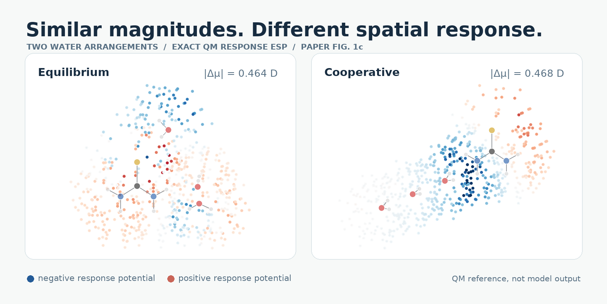

<div align="center">

# GLIDER

### A spatial view of molecular electronic response

The code, frozen model and evidence behind **Sparse Supervision Turns Polar Pretraining into Transferable Molecular Response Fields**<br>
Gal Oren · Boris Fain · Michael Levitt<br>
Accepted at the **2nd SIMBIOCHEM Workshop at NeurIPS 2026**

[The idea](#the-idea) · [The evidence](#the-evidence) · [Explore the data](#explore-the-data) · [Reproduce](#reproduce) · [Citation](#citation)

</div>

<p align="center"></p>

<p align="center"><sub>Exact QM fields from paper Fig. 1c. Blue marks negative response potential and red positive response potential; the molecular drawings and field layers are preserved from the paper source.</sub></p>

## The idea

A neighbouring molecule does not experience a dipole magnitude. Its atoms sample an **electrostatic potential at particular locations**. The two water arrangements above have nearly the same induced-dipole *magnitude* (0.464 and 0.468 D), yet place their negative-potential regions differently. Their full dipole vectors need not be equal.

**GLIDER** (Geometry-Learned Induced Dipole and Electrostatic Response) learns the *interaction-induced change in that potential*. At fixed geometry, the QM target is the potential of the complex minus the potentials of its separately evaluated fragments, all in the same counterpoise-consistent basis:

$$\Delta V_{\mathrm{resp}}(\mathbf r;X)=V_{SE}(\mathbf r;X)-V_S^{E\text{-ghost}}(\mathbf r;X)-V_E^{S\text{-ghost}}(\mathbf r;X).$$

The model represents this response with atom-centred charges and dipoles. Its output conserves total response charge and reconciles the site moment with a separately predicted molecular response dipole. The negative gradient of the potential gives the electric field. This is the **mutual response of the fragments**, not a unique decomposition into polarization and charge transfer.

<p align="center"></p>

The recipe is deliberately small: **48 response-labelled solute-plus-three-water environments**, spanning **14 chemistries**, train only the GLIDER response head. Geometry-dependent features from MACE-POLAR-1-M and a starting response built from frozen MACE-POLAR-1-M/-1-L predictions supply the pretrained inputs. Neither foundation checkpoint is fitted to these response labels. We use independently evaluated, response-unfitted **MACE-POLAR-1-L** as the **polar baseline**.

## The evidence

### 1 · Transfer across solutes

The same frozen checkpoint was evaluated prospectively on **56 solutes absent from GLIDER response supervision**, in **224 three-water environments**. Exposure to these identities during broad foundation-model pretraining is unknown. Response-ESP error fell by **32–40%** relative to the polar baseline across three separately acquired panels; **54 of 56 solutes** improved.

<p align="center"></p>

The strongest result is **spatial response transfer**. Global response-dipole gains are less decisive, and Panel I did not pass a broader preregistered gate requiring both ESP and dipole improvements. Those cases and the frozen checkpoint remain in the release. [See the three panels and paired intervals →](results/README.md#how-to-read-the-primary-comparison)

### 2 · Change the neighbour

In a **separate 12-solute test** (72 cases), the same model was evaluated with NH₃, CH₃OH and CH₃CN environments. Response-ESP NRMSE was **0.450** for GLIDER versus **0.617** for the polar baseline, a **27.0% reduction**. Both neighbour identity and environment size changed, so this is a transfer test rather than an isolated substitution experiment. [Inspect the per-species data →](data/figure_data/Fig5_nonwater_effects.csv)

### 3 · Put the field to use

A fourth water probes a response computed for a solute plus W1–W3. **W4 is absent from both the model input and the base-response QM calculation.** At W4, the frozen, one-way response-coupling energy MAE is **0.049 kcal mol⁻¹** for GLIDER versus **0.114 kcal mol⁻¹** for the polar baseline.

<p align="center"></p>

This is a **Coulomb response component**, not total interaction or solvation energy and not self-consistent polarization. An exact QM *response dipole* at one predefined origin is a useful global-moment control in the near field. Higher exact multipoles recover with distance and eventually outperform GLIDER in the fixed-charge far-field test. [See the distance control →](assets/distance-and-moments.svg)

## Explore the data

Every figure and table in the paper has a [paper-to-data map](results/README.md). The underlying CSVs retain their source filenames, which sometimes differ from the final paper's figure numbers; the map resolves them.

| Start here | What you can inspect |
|:--|:--|
| [Prospective results](results/README.md) | Figure and panel mapping, 56-solute aggregate and paired comparisons, plus frozen output tables. |
| [Geometries, predictions and QM references](data/README.md) | The three prospective panels and the camera-ready numeric source tables. |
| [Frozen checkpoint](checkpoints/README.md) | The five-member response head and its training manifest. |
| [Chronology and provenance](evidence/README.md) | Prediction-before-reference manifests, byte-preserved source code, hashes and the retained Panel-I gate result. |
| [Use on a geometry](scripts/benchmark/README.md) | Inference wrapper, example input and third-party checkpoint setup. |

The [Figure 1c image layers](assets/figure1_source/README.md) are exact source assets. The other gallery graphics are reading aids: quantitative charts are rendered from released CSVs, while the architecture diagram is conceptual. No manuscript PDF or LaTeX package is included here.

## Reproduce

The **lightweight path** verifies the released checkpoint and archives and recomputes prospective aggregate statistics; it does not rerun quantum chemistry or change the frozen model. Python 3.11+ is recommended.

```bash
git clone https://github.com/Scientific-Computing-Lab/GLIDER_AI.git
cd GLIDER_AI
python -m venv .venv
source .venv/bin/activate
python -m pip install -e .
python scripts/reproduce/verify_release.py
python scripts/reproduce/recompute_statistics.py --root . --output /tmp/glider-statistics
python scripts/verify_companion.py
```

For a **new geometry**, install the model extra, the paper-matched [MACE source](https://github.com/ACEsuit/mace/tree/91df5a2032b24ff9e23e0dc7b9407dde0da6fb31), and its official MACE-POLAR-1 M/L checkpoints. The [inference guide](scripts/benchmark/README.md) gives the complete command; third-party weights are fetched from their publisher and are not redistributed here. To regenerate the visual gallery, install `.[figures]` and run `python scripts/render_figures.py` and `python scripts/render_readme_field.py`.

## Citation

Please cite **Gal Oren, Boris Fain and Michael Levitt, “Sparse Supervision Turns Polar Pretraining into Transferable Molecular Response Fields,” 2nd SIMBIOCHEM Workshop at NeurIPS 2026**. Machine-readable details are in [`CITATION.cff`](CITATION.cff). Software is [MIT licensed](LICENSE); third-party models retain their own licences. Correspondence: [galoren@stanford.edu](mailto:galoren@stanford.edu) and [levittm@stanford.edu](mailto:levittm@stanford.edu).

**Scope:** the tested systems are neutral, closed-shell organic solutes with the specified molecular neighbours. Ions, arbitrary condensed phases, self-consistent embedding, complete interaction energies and molecular-dynamics performance remain outside the evidence in this release.
