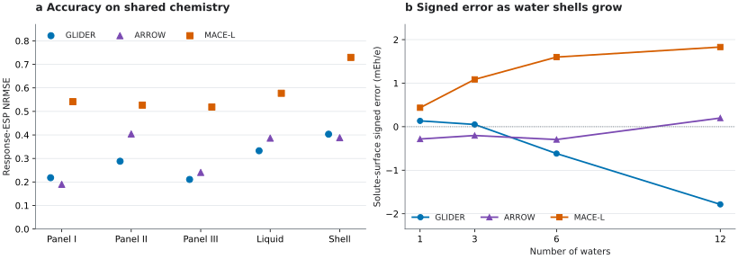

# ARROW on the shared GLIDER reference configurations

This is the **post hoc independent polarizable-model comparison** in the expanded GLIDER journal manuscript (Fig. 9 and Supplementary Section 15). Classic analytical ARROW was evaluated by Boris Fain without its neural pair-energy correction and without refitting to GLIDER data. The predicted response is the complex cloud-dipole solution minus the two fragment solutions, evaluated on **exactly the same QM probe points** as GLIDER. `arrow_smeared` uses ARROW's native cloud electrostatics; `arrow` evaluates the same response dipoles as points.

ARROW could type **11 of the 62 distinct solutes** represented across the five source sets. The common subset has **68 configurations** and **13 solute–set groups** because urea and 2-butanone each appear in both the liquid and shell-size sets. A missing ARROW result means the classic parameter database did not cover that chemistry; it is not an error value. The comparison was computed after the QM references existed and is **not a fourth prospective panel**. Panel I later entered a separate development pool.



**Fig. 9 reading aid.** Left: response-ESP NRMSE on identical, atom-type-covered
configurations. Right: mean signed error on probes nearest the solute for the
two covered shell-size solutes. The plot is rebuilt from `audit.json` and the
case-level signed-bias table with
`python scripts/figures/plot_arrow_comparison.py`.

| Shared set | Configurations | Groups | GLIDER | ARROW native | ARROW point | MACE-L |
|:--|--:|--:|--:|--:|--:|--:|
| [Panel I](../panel_1/) | 4 | 1 | 0.218 | 0.190 | 0.195 | 0.541 |
| [Panel II](../panel_2/) | 16 | 4 | 0.288 | 0.404 | 0.412 | 0.527 |
| [Panel III](../panel_3/) | 16 | 4 | 0.211 | 0.241 | 0.247 | 0.519 |
| [Liquid-derived](../liquid/) | 8 | 2 | 0.333 | 0.386 | 0.394 | 0.577 |
| [Shell size](../shell_size/) | 24 | 2 | 0.403 | 0.388 | 0.396 | 0.730 |
| **All covered** | **68** | **13** | **0.283** | **0.332** | **0.339** | **0.564** |

Scores are mean configuration response-ESP NRMSE within each solute–set group, then an equal mean over groups. The observed ARROW-minus-GLIDER mean is **0.0487**, but a 100,000-resample paired bootstrap clustering the 13 groups by 11 unique solutes has a 95% percentile interval of **−0.0174 to +0.1292**. This small covered subset does not resolve a population-level difference. Excluding the shell-size groups gives GLIDER **0.262**, ARROW **0.322** and MACE-L **0.534** on 44 cases. These are alternate summaries, not extra data.

## What the size series adds

For the two typable shell-size solutes, ARROW's native-cloud NRMSE remains between 0.37 and 0.42 from 1 to 12 waters, whereas GLIDER changes from 0.38 to 0.49. The [signed solute-surface error table](shell_size_signed_bias_per_config.csv) shows ARROW's mean within ±0.30 mEh/e, GLIDER reaching −1.78 and MACE-L +1.83 mEh/e at 12 waters. A near-zero signed mean can hide cancelling errors, so read it alongside the NRMSE. The six trajectories at each size are a diagnostic, not a condensed-phase simulation.

## Files and verification

- `../{panel_1,panel_2,panel_3,liquid,shell_size}/predictions/arrow_smeared/` and `arrow/`: 136 collaborator-supplied prediction NPZ arrays, registries and manifests. The five experiment directories hold the original geometries and QM references.
- [`source_tables/`](source_tables/): case scores, per-solute and aggregate tables, and coverage reasons for each source set.
- [`audit.json`](audit.json): independent array-level audit, including the archive digest and paired bootstrap intervals.
- [`shell_size_signed_bias_per_config.csv`](shell_size_signed_bias_per_config.csv): signed errors on probes whose nearest atom belongs to the solute. All 96 entries were rederived from the released geometry, probe and field arrays.
- [`arrow_vs_qm_separation_cyclic_carbamate.csv`](arrow_vs_qm_separation_cyclic_carbamate.csv): a **separate one-solute** collaborator summary of ARROW against the direct separation QM check. Its QM and GLIDER columns match the released reference summary, but the transferred archive did not contain the underlying ARROW separation probe arrays, so those ARROW scores were not independently rescored here. The exact zero at 15 Å is a real-space cutoff artifact without PME, not evidence of the physical long-range limit.
- [`arrow_vs_qm_interaction_energy.csv`](arrow_vs_qm_interaction_energy.csv): collaborator-supplied energy diagnostic, separate from the response-field endpoint. The stored QM water-cluster counterpoise energies include D3(BJ); this table does not establish an exchange-compensation mechanism.

Recompute the released common-subset field scores, three paired bootstrap
intervals and all 96 signed-bias entries from the arrays, without ARROW
software or new QM:

```bash
python scripts/reproduce/score_arrow_release.py
```

The original collaborator archive (SHA-256 `308c4718d3d8561b4084d5c007e3f3c3336cc98eeb277a770855c28062520beb`) was separately audited with `scripts/reproduce/audit_arrow_package.py`. Its 136 prediction-file hashes, 68 probe-point alignments, all reported configuration NRMSEs and 96 signed-bias rows matched. The archive was checked against GLIDER_AI commit `82b9d33`; the five scored reference sets are unchanged in the subsequent separation-QM release `686264d`.

The public release contains numerical predictions and scoring data, **not** ARROW's parameter database or private raw force-field runs. It allows independent rescoring of the reported compact-case field results, but not rerunning ARROW's self-consistent cloud solve from scratch.
