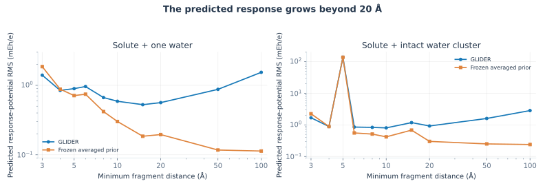

# Fragment separation at 3–20 Å

For each of the 14 original training solutes, translate either one water or the intact original environment away from the stationary solute. Keep internal geometry and solute-centred probe points fixed. Recompute the polar features, averaged prior and frozen GLIDER head at every geometry.

[Geometries](configurations.extxyz) · [Distance registry](configuration_registry.csv) · [Protocol](protocol.json) · [Probe points](solute_probe_points.npz) · [Predicted fields and sites](predicted_probe_potentials.npz) · [Per-case results](results.csv) · [Mean curves](summary.csv)

**The response does not vanish.** At 20 Å, the GLIDER mean surface-potential RMS is 0.564 mEh/e for a single water and 0.925 mEh/e for the intact environment. The averaged prior also retains a residual. These are predicted response amplitudes, not finite-distance errors against newly computed QM.

This test identifies a failure of fragment-separation consistency. Charge conservation and moment reconciliation do not impose that condition. **Paper:** Fig. S7 and Appendix K.4. [Reproduction](../../docs/reproduce.md#author-review-controls).

The intact-environment mean at 5 Å is dominated by `dev_thio_amide`, whose response RMS reaches about 1.91 Eh/e in both the averaged prior and GLIDER. This anomalous extrapolation is retained in the logarithmic paper plot. [Probe-to-environment clearance](probe_clearance.csv) and raw site values are included for diagnosis.
