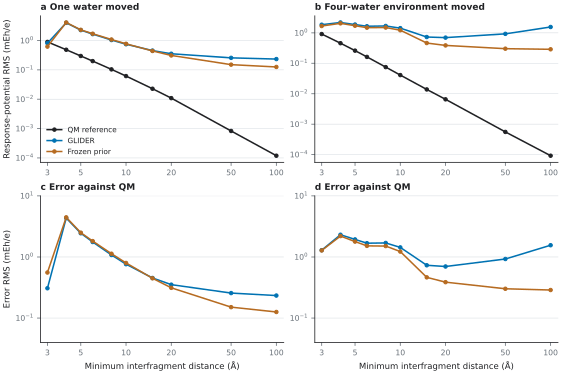

# A direct QM check of fragment separation

The [14-solute separation sweep](../dissociation/) first showed that the frozen GLIDER model predicts a nonzero response when an inducing water cluster is moved far from a solute. This post hoc check asks whether that prediction is an error against quantum chemistry on one of those solutes, `dev_cyclic_carbamate`.

For the archived compact configuration, we move either its first water alone (omitting the other three waters) or its intact four-water environment. The solute, each moved fragment's internal geometry, and the 512 solute-centred probe positions stay fixed. Each system is evaluated at minimum interfragment distances of 3, 4, 5, 6, 8, 10, 15, 20, 50 and 100 Å. The released GLIDER checkpoint and averaged polar prior were frozen before these new QM calculations; neither was fitted to the translated geometries.

The reference at each geometry is the complex electrostatic potential minus those of the two ghost-basis fragments, using restricted ωB97X-D3(BJ)/def2-TZVPD, grid level 4 and SCF tolerance 10⁻¹⁰. All 60 component SCFs converged. Panels **a,b** show the RMS response potential; **c,d** show prediction error against the new QM potential. All values are RMS over the same 512 probes, in mEh/e.

| System at 100 Å | QM response RMS | GLIDER RMS | Prior RMS | GLIDER error RMS | Prior error RMS |
|:--|--:|--:|--:|--:|--:|
| One water moved | 0.000119 | 0.233789 | 0.125824 | 0.233739 | 0.125837 |
| Four waters moved | 0.000092 | 1.556337 | 0.287897 | 1.556399 | 0.287907 |

The QM response tends to zero in both systems. For the four-water system, GLIDER's predicted amplitude rises from 0.697 at 20 Å to 1.556 mEh/e at 100 Å, while QM falls from 0.00654 to 0.000092 mEh/e. In the one-water system, GLIDER's amplitude declines over this interval but remains above the QM response. At 100 Å, the counterpoise interaction energy is below 0.0001 kcal/mol in magnitude for both systems. This verifies a separation-limit error for this solute; the wider 14-solute curves remain prediction-only, and this one case does not estimate the prevalence of the error across solutes.

## Open the data

- [All 20 geometries](configurations.extxyz), [fixed probe positions](solute_probe_points.npz), and [frozen site and probe predictions](predicted_probe_potentials.npz)
- [Complete 20-row results table](summary.csv) and [vector PDF figure](diagnostic.pdf)
- One `.json` record and `.npz` array file per configuration, named by system and distance. The arrays contain each component's ESP, the subtracted QM response, both predictions, component energies and the QM response dipole. The JSON records contain convergence attempts, source hashes, method and scores.
- [Source manifest](source_manifest.json) links the curated 20-case package to the original 3–20 Å and 50–100 Å archives. [CPU validation](validation/) releases independent arrays and per-condition differences for 12 distinct cases.

Run `python scripts/verify_companion.py` from the repository root to rederive every reported potential RMS and check the array and source hashes. To repeat the expensive SCFs, install `.[contact,figures]`, then run `python scripts/diagnostics/run_cyclic_carbamate_separation_qm.py --output build/separation_qm_dev_cyclic_carbamate` followed by `python scripts/diagnostics/summarize_cyclic_carbamate_separation_qm.py build/separation_qm_dev_cyclic_carbamate`. A CPU backend is the default; the released GPU references used GPU4PySCF with the same reference Hamiltonian. Independent CPU reruns of 12 distinct conditions gave a maximum pointwise potential difference of 0.00112 mEh/e and a maximum per-case RMS difference of 0.00017 mEh/e.

**Paper:** expanded journal manuscript, Supplementary Section 11.4 and Supplementary Fig. S18. The workshop's Fig. S7 and the journal's Fig. 8c,d show the separate 14-solute frozen-prediction sweep.
