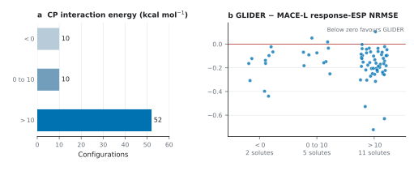

# Changing the molecular neighbours: the original geometry challenge

The frozen test has 72 configurations: 12 Panel-I solutes × three neutral species (NH₃, CH₃OH, CH₃CN) × two placements. Its fixed water-trained checkpoint lowers equal-solute response-ESP NRMSE from 0.617 for MACE-POLAR-1-L to 0.450. These are valid scores on the released geometries. Neighbour identity **and** neighbour number change together.

**A subsequent geometry audit changes the interpretation.** The original placement rule put each new molecule at a water-oxygen anchor without relaxing the contact. Counterpoise interaction energies computed from the stored QM component energies are positive in 62/72 cases, and 52/72 exceed +10 kcal mol⁻¹. The median is +23.7 kcal mol⁻¹. Thus the 27.0% score reduction is evidence that GLIDER predicts this frozen *geometry challenge* better than the unfitted polar baseline, but it does not establish transfer at ordinary attractive non-water contacts. No configuration was removed from the original score.



The energy is `E(complex) − E(solute with neighbour ghosts) − E(neighbour with solute ghosts)` under the released counterpoise-consistent Hamiltonian. A positive interaction energy is a fixed-geometry sanity signal; it does not by itself identify which physical component dominates the electronic response. The ten cases with negative interaction energy involve only two solutes, so they cannot rescue a general transfer claim. This post hoc audit is fully reproducible from the files below:

```bash
uv run --no-project --with 'ase==3.29.0' python scripts/reproduce/audit_nonwater_contacts.py
python scripts/figures/plot_nonwater_contact_audit.py
```

[Case-level contact and energy audit](contact_audit.csv) · [Audit summary](contact_audit_summary.json) · [Vector figure](contact_audit.pdf) · [Full paper map](../../docs/paper_map.md)

A separately designed [36-case contact follow-up](../nonwater_contact/) uses the same frozen checkpoint and new QM references. All 36 optimized contacts have negative QM interaction energy, and the follow-up's complete response scores are reported independently. They are not substituted into the original 72-case estimate.

| Open | Contents |
|:--|:--|
| [Geometries](geometries/) | ExtXYZ coordinates, solute identities, water counts and configuration registry. |
| [QM references](references/) | Full per-configuration reference potentials, probe coordinates and dipoles. |
| [Predictions](predictions/) | Frozen outputs, grouped by method, on the same probe coordinates. |
| [Results](results.csv) | Recomputed per-configuration response errors. |
| [Solute results](solute_results.csv) | Configurations averaged within solute. |
| [Summary](summary.csv) | Equal-solute aggregate metrics. |

```bash
python scripts/reproduce/score_experiment.py --experiment nonwater
```

Run from the repository root. The script reads the raw reference and prediction arrays and writes a fresh result under `build/recomputed/nonwater/`. [Units and NPZ fields](../../docs/data_format.md).

[Selection and label chronology](../../docs/data_lineage.md) · [Back to experiments](../README.md)
