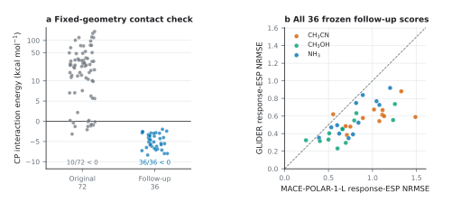

# Non-water contacts after geometry correction

The [original 72-case replacement panel](../nonwater/) changed each water neighbour into NH₃, CH₃OH or CH₃CN at the water-oxygen anchor. Its model scores are reproducible, but an energy audit found that most unrelaxed contacts are repulsive. This **separate follow-up** asks the narrower question left open by that audit: how does the already published, water-trained GLIDER checkpoint perform when the new neighbours are placed at plausible fixed-solute contacts?



All **36/36 new QM interaction energies are negative** (median −4.86 kcal mol⁻¹; range −8.36 to −1.98). On these geometries, equal-solute response-ESP NRMSE is **0.538 for GLIDER versus 0.827 for MACE-POLAR-1-L**, a 34.9% reduction. The paired GLIDER-minus-baseline difference is −0.288 (95% solute-blocked bootstrap interval −0.375 to −0.205). GLIDER has lower error in 34/36 individual configurations and for all 12 solutes after averaging their three neighbours.

| Neighbour | GLIDER NRMSE | Polar baseline NRMSE | Solutes |
|:--|--:|--:|--:|
| NH₃ | 0.582 | 0.793 | 12 |
| CH₃OH | 0.440 | 0.698 | 12 |
| CH₃CN | 0.593 | 0.989 | 12 |

The original 72-case scores remain unchanged. This follow-up supports a **bounded contact-geometry result** for these 12 solutes and three neutral neighbours. MACE-POLAR-1-L also contributes to GLIDER's frozen starting prior, so this comparison measures what response-specific supervision adds to that prior. It does not compare against an independent polarizable-physics model or establish behavior for arbitrary non-water environments.

## Design and chronology

The follow-up retains the same 12 solutes and three neighbour species, so it does not select solutes in light of the original errors. For each solute/species pair, the two original poses are starting points for constrained MMFF94s relaxation of the neighbour. The solute stays fixed. The lower converged MMFF interfragment-energy pose is accepted only when that energy is negative and the shortest cross-fragment heavy-atom distance is at least 2.4 Å. This produces 36 geometries, one for each solute/species pair. MMFF is used to construct geometry, not to label or score the electronic response.

All 36 geometries and both complete prediction sets were hashed in [`prediction_freeze.json`](prediction_freeze.json) **before any new QM response reference was calculated**. GLIDER uses the released checkpoint unchanged. MACE-POLAR-1-L is evaluated independently without response-specific fitting on the same probe coordinates. The subsequent QM calculation uses the same counterpoise-consistent ωB97X-D3(BJ)/def2-TZVPD response definition as the paper. [`design_manifest.json`](design_manifest.json) records the geometry rule and [`configuration_registry.csv`](configuration_registry.csv) maps every case to its source and selected pose.

This was designed after the original-panel critique. It is a frozen-prediction follow-up, not an independent preregistered replication. Its 12 solutes belonged to Panel I, whose response references were already known when this new geometry rule was chosen. Neither those labels nor the new labels were used to fit the checkpoint or select a new case by its response error.

## Open the evidence

| Item | What it contains |
|:--|:--|
| [Geometries](configurations.extxyz) and [candidate registry](candidate_registry.csv) | All 36 selected structures and optimization outcomes for both [archived starting poses](../nonwater/geometries/) per pair. |
| [Frozen predictions](predictions/) | Per-case GLIDER and MACE-POLAR-1-L ESP and dipole arrays on identical probe points. |
| [QM references](references/) | Per-case complex and ghost-fragment energies, potentials, dipoles, response differences and convergence records. |
| [Case scores](results.csv) and [solute scores](solute_results.csv) | Response-ESP errors and fixed-geometry interaction energies, before and after within-solute averaging. |
| [Summary](summary.json), [Figure 5b data](figure_effects.csv) and [vector contact plot](contact_followup.pdf) | Equal-solute estimates, paired solute-blocked intervals and figure values. |

The counterpoise interaction energy is a **geometry check**. A negative value does not isolate polarization or prove that a pose is a thermodynamic minimum. The reported response metric is the potential of the full-complex-minus-ghost-fragments electronic change, not total interaction energy.

From the repository root, verify the frozen arrays and recompute all scores without rerunning SCF:

```bash
python scripts/diagnostics/score_nonwater_contact_panel.py --base experiments/nonwater_contact
```

The generator, freeze and reference-acquisition code is in [`scripts/diagnostics/`](../../scripts/diagnostics/). [All experiments](../) · [Paper-to-data map](../../docs/paper_map.md) · [Array and unit guide](../../docs/data_format.md)
